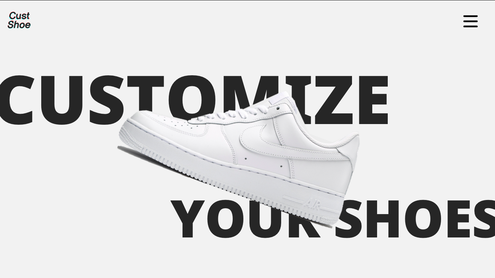
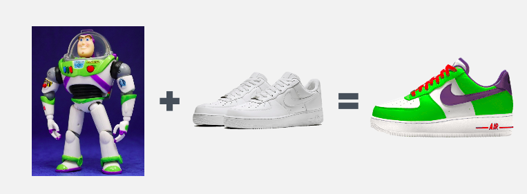

# CustShoes
## 2019년 데이터 진흥원 청년인재 프로젝트

---

  <h2 style='font-weight: bold; font-size:18px;'>CustShooes</h2>
  
   
  </a>
  

 semantic segmentation 의 MR-CNN 모델을 이용하여 직접 수집,라벨링한 데이터에 훈련하여 이미지를 넣으면 객체추출, ML기반 알고리즘바탕으로 주요 색상을 뽑아 커스텀

    <h2 style='font-weight: bold; font-size:18px;'>Customize your own shoes </h2>
    
  </a>

 

